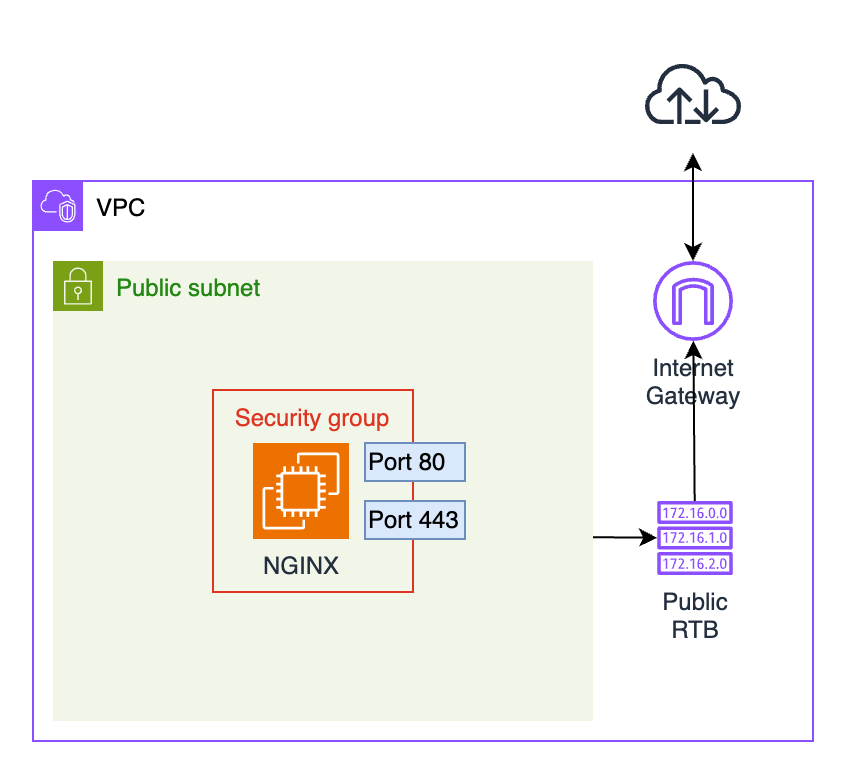

# AWS에 NGINX 서버 배포하기

이 프로젝트에서는 AWS에 NGINX 서버를 배포할 것입니다. 새 VPC를 생성하고, 공용 및 사설 서브넷을 설정하고, Ubuntu AMI를 사용하여 EC2 인스턴스를 배포할 것입니다. 나중에 인스턴스를 NGINX Bitnami AMI로 교체하고 보안 그룹과 연결합니다. 마지막으로 웹사이트 접근성을 테스트하고 리소스에 프로젝트 정보를 태그합니다. 가능한 한 많은 리소스에 Terraform을 사용하고, 불필요한 비용을 피하기 위해 프로젝트가 끝나면 모든 리소스를 삭제하는 것을 잊지 마세요.

## Project Overview

## Desired Outcome

1. 원하는 지역의 AWS에 새 VPC를 배포합니다.
2. VPC 내에 퍼블릭 서브넷과 프라이빗 서브넷을 배포합니다.
    1. **Hint:** 공용 서브넷은 인터넷 게이트웨이 경로가 포함된 사용자 지정 경로 테이블과 연결되어야 합니다.
3. 포트 80(HTTP) 및 443(HTTPS)에서만 트래픽을 허용하는 보안 그룹을 생성합니다.
4. 우분투 AMI를 사용하여 공용 서브넷에 EC2 인스턴스를 배포합니다.
5. 이전 인스턴스를 삭제하고 무료인 NGINX Bitnami AMI를 사용하여 다른 EC2 인스턴스를 배포합니다.
6. 배포된 NGINX 인스턴스를 생성한 보안 그룹에 연결하고, 해당 공인 IP를 통해 웹사이트에 접속할 수 있는지 확인합니다.
    1. **Hint:** `https://`로 접속하면 인증서 오류가 발생할 수 있습니다. 오류를 무시하고 웹사이트를 계속 진행해도 안전합니다.
7. 프로젝트에 대한 유용한 정보로 리소스에 태그를 지정합니다.
8. 프로젝트가 끝나면 모든 리소스를 삭제하세요!
