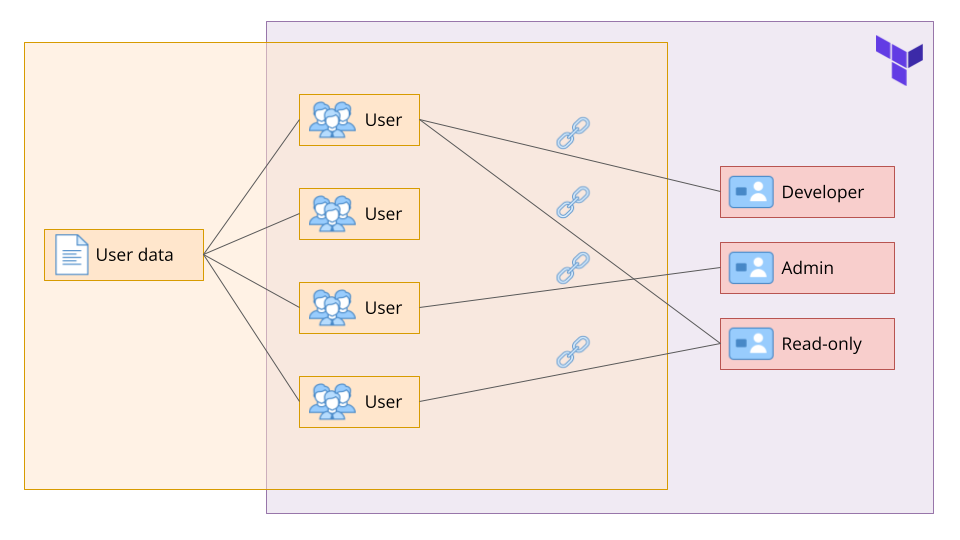

# Terraform으로 IAM 사용자 및 역할 관리하기

이 프로젝트는 Terraform과 YAML을 사용해 AWS ID 및 액세스 관리(IAM) 사용자 및 역할을 관리하는 데 중점을 두고 있습니다. 주요 목표는 사용자를 생성하고, 역할을 할당하고, 안전한 역할 할당을 보장하는 프로세스를 자동화하는 것입니다. 사용자 이름과 역할을 포함한 사용자 정보는 YAML 파일에 저장되며, 역할 정보는 Terraform에서 관리됩니다. 이 프로젝트의 중요한 측면은 역할이 할당된 사용자만 역할을 맡을 수 있도록 하여 보안을 한층 더 강화하는 것입니다.

## Project Overview

## Desired Outcome

1. 사용자 정보(사용자 이름 및 해당 역할)를 YAML 파일에 저장합니다.
2. 역할 정보(역할 이름 및 해당 정책)를 Terraform에 저장합니다.
    1. **Hint:** AWS 관리형 정책을 사용하면 더 쉽게 사용할 수 있지만, 더 많은 학습과 도전을 원하신다면 직접 정책을 생성해 보세요!
3. 제공된 YAML 파일을 기반으로 AWS 계정에 사용자를 생성합니다.
4. 또한 사용자가 AWS 콘솔에 로그인할 수 있도록 사용자에 대한 로그인 프로필을 생성합니다.
    1. **Hint:** 이메일을 통해 비밀번호를 안전하게 전송하기 위해 필요한 요소를 설정하는 것은 상당히 번거로울 수 있습니다. **실제 프로덕션 프로젝트에서는 절대 그렇게 해서는 안 되지만**, 여기서는 테라폼에서 이 정보를 자유롭게 출력할 수 있습니다.
5. 테라폼에 저장된 역할 정보를 기반으로 각 역할을 생성하고 해당 역할에 올바른 정책을 첨부합니다.
6. YAML 파일을 기반으로 생성된 사용자를 해당 사용자가 맡을 수 있는 각 역할에 연결합니다.
7. 해당 역할에 할당된 사용자만 역할을 맡을 수 있는지 확인합니다.
8. AWS 콘솔에서 모든 것을 테스트해 보세요!
9. 프로젝트가 끝나면 모든 리소스를 삭제하세요!
